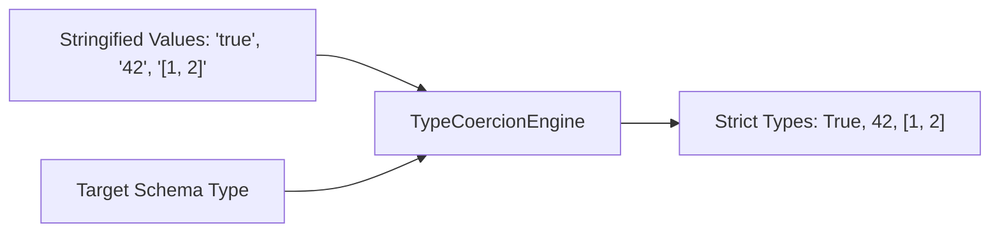

# genpark-type-coercion-and-casting-engine-skill

Type casting and coercion engine normalizing stringified values into schema-compliant Python primitives and structures.

## Architecture

## Features
- **Zero Dependencies**: 100% Python Standard Library.
- **Fail-Safe**: Returns original value if casting is impossible.
